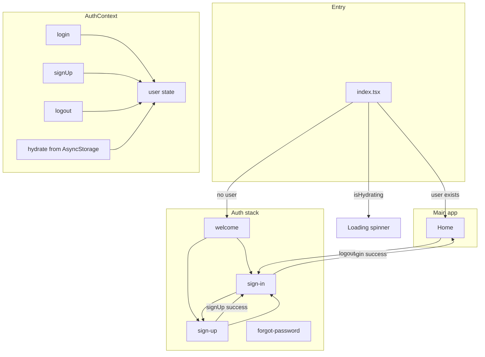
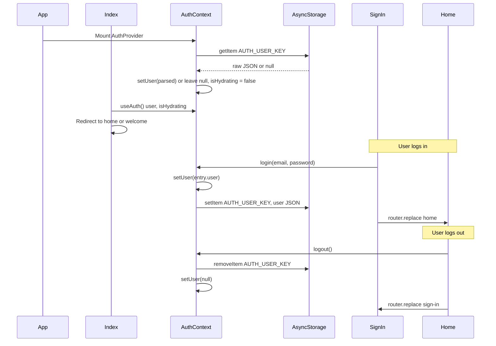

# Architecture & technical overview

This document describes how the UpperSpace auth app is built: flow, tech stack, and main technical decisions.

---

## 1. App flow (high level)

On launch, the app loads the root layout, then the **index** screen. The index screen reads auth state (with a short hydration phase) and redirects:

- If **user is logged in** (from memory or AsyncStorage) → **Home**.
- Otherwise → **Welcome** (auth stack), from which the user can go to Sign In or Sign Up.

After **login** or **signup**, navigation goes to Home or Sign In respectively. From **Home**, **Logout** clears the user and redirects to Sign In.

---

## 2. Screen flow (navigation)

- **Root layout** (`app/_layout.tsx`): `SafeAreaProvider` → `AuthProvider` → `Stack` with screens `index`, `(auth)`, `(root)`.
- **index** (`app/index.tsx`): Uses `useAuth()`. While `isHydrating` is true, shows a loading spinner. When false, redirects to `/(root)/home` if `user` is set, else to `/(root)/(auth)/welcome`.
- **(root)** (`app/(root)/_layout.tsx`): Stack with `(auth)` and `home`.
- **(auth)** (`app/(root)/(auth)/_layout.tsx`): Stack of welcome, welcome-2, welcome-destination, sign-up, sign-in, forgot-password (all headerless).
- **home** (`app/(root)/home.tsx`): Main screen after login (no separate tab group).

So: **Login** = sign-in, **Signup** = sign-up, **Home** = `/(root)/home`. All navigation uses Expo Router’s `router.replace()` or `Redirect` to avoid stacking unnecessary screens.

---

## 3. Authentication flow (technical)

- **AuthContext** holds: `user`, `isHydrating`, `login`, `signUp`, `logout`, `sendPasswordResetCode`.
- **Credentials** are kept in an in-memory `Map` (email → { user, password }) for the assignment; only the current **user** object (name, email) is persisted in AsyncStorage.
- **Hydration**: On mount, AuthProvider reads AsyncStorage once; if valid JSON and valid `User` shape, it sets `user`; otherwise it leaves `user` null. Then it sets `isHydrating` to false so the index can redirect.

---

## 4. Tech stack

| Category        | Technology |
|----------------|------------|
| Runtime        | React 19.1, React Native 0.81 |
| Framework      | Expo ~54 |
| Routing        | Expo Router ~6 (file-based; built on React Navigation) |
| Navigation     | @react-navigation/native, bottom-tabs, elements; react-native-screens, safe-area-context, gesture-handler |
| Styling        | NativeWind 4, Tailwind CSS 3.4 |
| Language       | TypeScript 5.9 |
| Persistence    | @react-native-async-storage/async-storage 2.2 |
| Icons          | phosphor-react-native, @expo/vector-icons |
| UI / media     | expo-image, expo-blur, react-native-svg |
| Tooling        | ESLint (eslint-config-expo), Prettier (prettier-plugin-tailwindcss) |

---

## 5. Key files and roles

| Path | Role |
|------|------|
| `app/_layout.tsx` | Root: fonts, splash, SafeAreaProvider, AuthProvider, root Stack. |
| `app/index.tsx` | Entry: auth hydration check, redirect to home or welcome. |
| `app/contexts/AuthContext.tsx` | Auth state, login/signUp/logout, AsyncStorage read/write, isHydrating. |
| `app/(root)/_layout.tsx` | Stack: (auth) and home. |
| `app/(root)/(auth)/_layout.tsx` | Auth stack: welcome, sign-in, sign-up, forgot-password. |
| `app/(root)/(auth)/sign-in.tsx` | Login screen: email/password, validation, login(), errors, link to sign-up. |
| `app/(root)/(auth)/sign-up.tsx` | Signup screen: name/email/password, validation, signUp(), errors, link to sign-in. |
| `app/(root)/home.tsx` | Home: show user name and email, logout button and confirmation modal. |
| `app/utils/validation.ts` | isValidEmail, validateLogin, validateSignUp, validateForgotPassword. |
| `app/components/form/FormField.tsx` | Reusable labeled input with error message. |
| `app/components/form/PasswordField.tsx` | Password input with visibility toggle (eye icon). |

---

## 6. Validation and errors

- **Validation** is done in `app/utils/validation.ts`: email regex, required fields, password length ≥ 6 for signup.
- **Login**: email required + valid format; password required (no min length).
- **Signup**: name, email, password required; email valid; password ≥ 6 characters.
- Screens call these validators on submit, then map returned errors to per-field and context error state (e.g. “Incorrect credentials” from AuthContext when `login()` rejects).

---

## 7. Persistence (AsyncStorage)

- **Key:** `AUTH_USER_KEY` (constant in AuthContext).
- **Stored value:** JSON string of `User` (`{ name, email }`). Passwords are not stored.
- **Read:** Once on AuthProvider mount; if parse succeeds and shape is valid (`isValidUser`), `setUser(parsed)`; otherwise ignore and clear key on corrupt data.
- **Write:** On successful `login()`, after `setUser(entry.user)`.
- **Clear:** On `logout()`, `removeItem(AUTH_USER_KEY)` and `setUser(null)`.
- **Limitation:** The credentials map is in-memory only. After app restart, the user can stay “logged in” via AsyncStorage, but if they log out and try to sign in again, they must sign up again (no persisted credentials).

---

## 8. UI and accessibility

- **Semantic structure:** Header, buttons, and form fields use appropriate roles and labels.
- **Password visibility:** PasswordField wraps FormField with a toggle (Eye/EyeSlash); `secureTextEntry` is tied to visibility state.
- **Errors:** Inline under fields and/or a single context error message above the submit button.
- **Logout:** Home uses a confirmation modal (LogoutConfirmModal) before calling `logout()` and redirecting.

---

This architecture supports the assignment’s requirements: Context-based auth, Login/Signup/Home screens, validation, optional persistence, navigation, and a clear, documented flow and tech stack.
